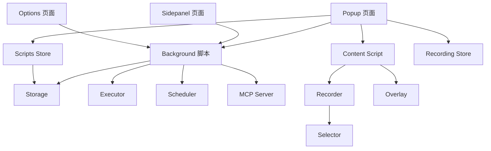

# OperationRecorder 项目 Code Wiki

## 1. 项目概述

OperationRecorder 是一个基于 Chrome 扩展的用户操作录制与回放工具，允许用户录制网页上的操作并将其保存为可重复执行的脚本。

- **技术栈**: Vue 3, Vite, UnoCSS, Naive UI, Pinia
- **扩展类型**: Chrome Manifest V3 扩展
- **主要功能**:
  - 录制用户在网页上的操作（点击、输入、导航等）
  - 管理录制的脚本（创建、编辑、执行、导出）
  - 回放录制的操作序列
  - 提供多种前端界面（Popup、Sidepanel、Options等）

## 2. 项目架构

### 2.1 整体架构

OperationRecorder 采用典型的 Chrome 扩展架构，包含以下核心部分：

```
src/
├── background/          # 后台脚本
│   ├── executor.js      # 脚本执行器
│   ├── index.js         # 后台主入口
│   ├── logger.js        # 日志工具
│   ├── mcp-server.js    # MCP 服务器
│   ├── scheduler.js     # 调度器
│   └── storage.js       # 存储管理
├── contentScript/       # 内容脚本
│   ├── index.js         # 内容脚本主入口
│   ├── logger.js        # 日志工具
│   ├── overlay.js       # 录制时的悬浮工具栏
│   ├── recorder.js      # 操作录制器
│   └── selector.js      # 元素选择器
├── render/              # 前端页面
│   ├── components/      # 组件
│   ├── composables/     # 组合式函数
│   ├── constants/       # 常量
│   ├── store/           # Pinia 状态管理
│   ├── types/           # 类型定义
│   ├── utils/           # 工具函数
│   └── views/           # 页面视图
│       ├── devtools/    # 开发者工具页面
│       ├── newtab/      # 新标签页
│       ├── options/     # 选项页面
│       ├── popup/       # 弹出页面
│       └── sidepanel/   # 侧边栏页面
├── utils/               # 通用工具
│   └── logger.js        # 通用日志工具
├── manifest.js          # 扩展配置
└── zip.js               # 打包工具
```

### 2.2 模块依赖关系



## 3. 核心模块

### 3.1 后台模块 (Background)

#### 3.1.1 主入口 (index.js)

**功能**：后台脚本的主入口，负责初始化核心模块、监听消息和处理各种事件。

**关键功能**：
- 初始化 Executor、Scheduler 和 MCP Server
- 处理来自 Popup、Content Script 的消息
- 管理设置页面的打开和关闭
- 处理发布文章请求

**主要消息处理**：
- `OPEN_SIDEPANEL` - 打开侧边栏
- `TOGGLE_OPTIONS` - 切换设置页面
- `PUBLISH_ARTICLE` - 处理发布文章请求
- `EXECUTE_SCRIPT` - 执行脚本
- `EXPORT_ALL_DATA` - 导出所有数据
- `IMPORT_ALL_DATA` - 导入所有数据
- `CLEAR_ALL_DATA` - 清空所有数据

[查看源码](file:///workspace/src/background/index.js)

#### 3.1.2 执行器 (executor.js)

**功能**：负责执行录制的脚本，模拟用户操作。

**主要功能**：
- 解析脚本动作
- 在指定标签页执行动作
- 处理执行过程中的错误

[查看源码](file:///workspace/src/background/executor.js)

#### 3.1.3 调度器 (scheduler.js)

**功能**：管理脚本的调度执行，支持定时任务。

**主要功能**：
- 初始化调度器
- 管理定时任务
- 执行调度的脚本

[查看源码](file:///workspace/src/background/scheduler.js)

#### 3.1.4 MCP 服务器 (mcp-server.js)

**功能**：提供 MCP (Model Context Protocol) 服务，用于与其他组件通信。

**主要功能**：
- 处理 MCP 消息
- 管理 MCP 连接

[查看源码](file:///workspace/src/background/mcp-server.js)

#### 3.1.5 存储管理 (storage.js)

**功能**：管理扩展的存储，包括脚本、录制数据等。

**主要功能**：
- 保存和加载脚本
- 导出和导入数据
- 清空数据

[查看源码](file:///workspace/src/background/storage.js)

### 3.2 内容脚本模块 (Content Script)

#### 3.2.1 主入口 (index.js)

**功能**：内容脚本的主入口，负责与页面和后台脚本通信。

**关键功能**：
- 监听来自页面的 postMessage 消息
- 处理来自后台的消息
- 执行录制和回放操作

**主要消息处理**：
- `START_RECORDING` - 开始录制
- `PAUSE_EXECUTION` - 暂停录制
- `RESUME_EXECUTION` - 恢复录制
- `STOP_RECORDING` - 停止录制
- `GET_RECORDING_STATUS` - 获取录制状态
- `GET_RECORDED_ACTIONS` - 获取录制的动作
- `CLEAR_RECORDED_ACTIONS` - 清空录制的动作
- `HIGHLIGHT_ELEMENT` - 高亮元素
- `EXECUTE_ACTION` - 执行动作

[查看源码](file:///workspace/src/contentScript/index.js)

#### 3.2.2 录制器 (recorder.js)

**功能**：核心录制逻辑，监听页面事件并记录用户操作。

**主要功能**：
- 开始、暂停、恢复和停止录制
- 监听页面事件（点击、输入、变化、键盘、滚动、导航）
- 记录用户操作
- 生成唯一的动作 ID
- 提供录制状态和动作列表

**关键类**：
- `Recorder` - 录制器类，包含录制的核心逻辑

**主要方法**：
- `start()` - 开始录制
- `pause()` - 暂停录制
- `resume()` - 恢复录制
- `stop()` - 停止录制
- `attachListeners()` - 附加事件监听器
- `detachListeners()` - 移除事件监听器
- `handleClick()` - 处理点击事件
- `handleInput()` - 处理输入事件
- `handleChange()` - 处理变化事件
- `handleKeydown()` - 处理键盘事件
- `handleScroll()` - 处理滚动事件
- `handleNavigate()` - 处理导航事件
- `addAction()` - 添加动作
- `getStatus()` - 获取录制状态
- `getActions()` - 获取录制的动作

[查看源码](file:///workspace/src/contentScript/recorder.js)

#### 3.2.3 悬浮工具栏 (overlay.js)

**功能**：录制时显示的悬浮工具栏，提供录制控制和状态显示。

**主要功能**：
- 显示和隐藏悬浮工具栏
- 提供录制控制按钮
- 显示录制状态和动作计数

[查看源码](file:///workspace/src/contentScript/overlay.js)

#### 3.2.4 元素选择器 (selector.js)

**功能**：生成元素的选择器，用于精确定位页面元素。

**主要功能**：
- 生成元素的 CSS 选择器
- 获取元素信息

[查看源码](file:///workspace/src/contentScript/selector.js)

### 3.3 前端模块 (Render)

#### 3.3.1 Popup 页面 (Popup.vue)

**功能**：扩展的弹出页面，提供录制控制和脚本管理功能。

**主要功能**：
- 开始/停止录制
- 显示脚本列表
- 执行、导出、删除脚本
- 创建新脚本

**核心组件**：
- 录制控制区
- 脚本列表
- 新建脚本弹窗

[查看源码](file:///workspace/src/render/views/popup/Popup.vue)

#### 3.3.2 状态管理 (store)

**功能**：使用 Pinia 管理应用状态，包括脚本和录制状态。

**主要 store**：
- `scripts.js` - 管理脚本
- `recording.js` - 管理录制状态
- `settings.js` - 管理设置

[查看源码](file:///workspace/src/render/store/)

#### 3.3.3 类型定义 (types)

**功能**：定义消息类型和动作类型。

**主要类型**：
- `messages.js` - 消息类型定义
- `actions.js` - 动作类型定义

[查看源码](file:///workspace/src/render/types/)

## 4. 关键类与函数

### 4.1 Recorder 类

**位置**：[contentScript/recorder.js](file:///workspace/src/contentScript/recorder.js)

**功能**：核心录制逻辑，监听页面事件并记录用户操作。

**构造函数**：
```javascript
constructor() {
  this.status = RECORDING_STATUS.IDLE
  this.recordedActions = []
  this.listeners = []
  this.currentUrl = window.location.href
  this.startTime = null
  // 绑定事件处理函数
  this.handleClick = this.handleClick.bind(this)
  this.handleInput = this.handleInput.bind(this)
  this.handleChange = this.handleChange.bind(this)
  this.handleKeydown = this.handleKeydown.bind(this)
  this.handleScroll = this.handleScroll.bind(this)
  this.handleNavigate = this.handleNavigate.bind(this)
}
```

**主要方法**：

| 方法名 | 描述 | 参数 | 返回值 |
|-------|------|------|-------|
| `start()` | 开始录制 | 无 | 无 |
| `pause()` | 暂停录制 | 无 | 无 |
| `resume()` | 恢复录制 | 无 | 无 |
| `stop()` | 停止录制 | 无 | `{ actions, startTime, endTime, duration }` |
| `getStatus()` | 获取录制状态 | 无 | `{ status, actionCount, duration }` |
| `getActions()` | 获取录制的动作 | 无 | 动作数组 |
| `clearActions()` | 清空录制的动作 | 无 | 无 |

### 4.2 后台消息处理函数

**位置**：[background/index.js](file:///workspace/src/background/index.js)

**功能**：处理来自各组件的消息。

**主要函数**：

| 函数名 | 描述 | 参数 | 返回值 |
|-------|------|------|-------|
| `handleOperationRecorderMessage()` | 处理 OperationRecorder 相关消息 | `request, sender, sendResponse` | `boolean` |
| `handleOpenSidepanel()` | 处理打开侧边栏 | `sendResponse` | 无 |
| `handleToggleOptions()` | 处理切换设置页面 | `sendResponse` | 无 |
| `handlePublishArticle()` | 处理发布文章 | `request, sendResponse` | 无 |

### 4.3 内容脚本消息处理函数

**位置**：[contentScript/index.js](file:///workspace/src/contentScript/index.js)

**功能**：处理来自后台和页面的消息。

**主要函数**：

| 函数名 | 描述 | 参数 | 返回值 |
|-------|------|------|-------|
| `executeAction()` | 执行动作 | `action` | `Promise<any>` |
| `highlightElement()` | 高亮元素 | `element` | 无 |
| `removeHighlight()` | 移除高亮 | 无 | 无 |
| `sleep()` | 等待指定时间 | `ms` | `Promise<void>` |
| `waitForElement()` | 等待元素出现 | `selector, timeout` | `Promise<Element>` |

### 4.4 前端组件函数

**位置**：[render/views/popup/Popup.vue](file:///workspace/src/render/views/popup/Popup.vue)

**功能**：Popup 页面的核心功能。

**主要函数**：

| 函数名 | 描述 | 参数 | 返回值 |
|-------|------|------|-------|
| `startRecording()` | 开始录制 | 无 | `Promise<void>` |
| `stopRecording()` | 停止录制 | 无 | `Promise<void>` |
| `executeScript()` | 执行脚本 | `scriptId` | `Promise<void>` |
| `deleteScript()` | 删除脚本 | `scriptId` | `Promise<void>` |
| `createNewScript()` | 创建新脚本 | 无 | `Promise<void>` |
| `exportScript()` | 导出脚本 | `scriptId` | `Promise<void>` |

## 5. 技术栈与依赖

### 5.1 核心依赖

| 依赖 | 版本 | 用途 | 来源 |
|------|------|------|------|
| Vue 3 | ^3.2.37 | 前端框架 | [package.json](file:///workspace/package.json) |
| Vite | ^7.1.7 | 构建工具 | [package.json](file:///workspace/package.json) |
| Pinia | ^3.0.4 | 状态管理 | [package.json](file:///workspace/package.json) |
| Naive UI | ^2.40.1 | UI 组件库 | [package.json](file:///workspace/package.json) |
| UnoCSS | ^66.5.2 | 原子化 CSS 引擎 | [package.json](file:///workspace/package.json) |
| webextension-polyfill | ^0.12.0 | 跨浏览器扩展 API | [package.json](file:///workspace/package.json) |
| loglevel | ^1.9.2 | 日志管理 | [package.json](file:///workspace/package.json) |
| uuid | ^13.0.0 | 生成唯一 ID | [package.json](file:///workspace/package.json) |
| vue-draggable-plus | ^0.6.1 | 拖拽功能 | [package.json](file:///workspace/package.json) |

### 5.2 开发依赖

| 依赖 | 版本 | 用途 | 来源 |
|------|------|------|------|
| @crxjs/vite-plugin | ^2.0.0-beta.26 | Chrome 扩展 Vite 插件 | [package.json](file:///workspace/package.json) |
| @vitejs/plugin-vue | ^6.0.1 | Vue Vite 插件 | [package.json](file:///workspace/package.json) |
| ESLint | ^9.36.0 | 代码质量检查 | [package.json](file:///workspace/package.json) |
| Prettier | ^3.0.3 | 代码格式化 | [package.json](file:///workspace/package.json) |
| crx3 | ^1.1.3 | CRX 打包工具 | [package.json](file:///workspace/package.json) |
| sharp | ^0.33.0 | 图片处理 | [package.json](file:///workspace/package.json) |

## 6. 项目运行方式

### 6.1 开发模式

1. 安装依赖：
   ```bash
   pnpm install
   # 或
   npm install
   ```

2. 启动开发服务器：
   ```bash
   pnpm dev
   # 或
   npm run dev
   ```

3. 加载扩展：
   - 打开 Chrome 浏览器的“开发者模式”
   - 点击“加载已解压的扩展”，选择 `build` 文件夹

4. 访问前端页面：
   - 普通前端开发模式：访问 `http://0.0.0.0:3000/`
   - 调试弹窗页面：打开 `http://0.0.0.0:3000/src/render/views/popup/popup.html`
   - 调试选项页面：打开 `http://0.0.0.0:3000/src/render/views/options/options.html`

### 6.2 构建与打包

1. 构建项目：
   ```bash
   pnpm build
   # 或
   npm run build
   ```

2. 打包为 ZIP：
   ```bash
   pnpm zip
   # 或
   npm run zip
   ```

3. 打包为 CRX：
   ```bash
   pnpm crx
   # 或
   npm run crx
   ```

4. 同时执行构建、ZIP 和 CRX 打包：
   ```bash
   pnpm pack
   # 或
   npm run pack
   ```

### 6.3 图标生成

生成不同尺寸的图标：
```bash
pnpm generate-logos
# 或
npm run generate-logos
```

## 7. 扩展权限

OperationRecorder 扩展需要以下权限：

| 权限 | 用途 | 来源 |
|------|------|------|
| sidePanel | 侧边栏访问 | [manifest.js](file:///workspace/src/manifest.js) |
| storage | 数据存储 | [manifest.js](file:///workspace/src/manifest.js) |
| cookies | Cookie 访问 | [manifest.js](file:///workspace/src/manifest.js) |
| notifications | 通知功能 | [manifest.js](file:///workspace/src/manifest.js) |
| tabs | 标签页管理 | [manifest.js](file:///workspace/src/manifest.js) |
| clipboardWrite/clipboardRead | 剪贴板操作 | [manifest.js](file:///workspace/src/manifest.js) |
| scripting | 脚本注入 | [manifest.js](file:///workspace/src/manifest.js) |
| contentSettings | 内容设置 | [manifest.js](file:///workspace/src/manifest.js) |
| downloads | 文件下载 | [manifest.js](file:///workspace/src/manifest.js) |
| background | 后台运行 | [manifest.js](file:///workspace/src/manifest.js) |
| alarms | 定时任务 | [manifest.js](file:///workspace/src/manifest.js) |
| desktopCapture | 桌面捕获 | [manifest.js](file:///workspace/src/manifest.js) |
| declarativeNetRequest | 网络请求拦截 | [manifest.js](file:///workspace/src/manifest.js) |
| debugger | DevTools 调试 | [manifest.js](file:///workspace/src/manifest.js) |
| history | 历史记录访问 | [manifest.js](file:///workspace/src/manifest.js) |
| activeTab | 活跃标签页访问 | [manifest.js](file:///workspace/src/manifest.js) |

## 8. 核心功能流程

### 8.1 录制流程

1. 用户点击 Popup 页面的“录制”按钮
2. Popup 发送 `START_RECORDING` 消息到 Content Script
3. Content Script 显示悬浮工具栏，开始录制
4. Recorder 类监听页面事件（点击、输入、导航等）
5. 用户在页面上执行操作，Recorder 记录这些操作
6. 用户点击 Popup 页面的“停止”按钮
7. Popup 发送 `STOP_RECORDING` 消息到 Content Script
8. Content Script 隐藏悬浮工具栏，停止录制
9. Content Script 返回录制的动作列表
10. Popup 创建新脚本并添加录制的动作

### 8.2 执行脚本流程

1. 用户在 Popup 页面选择脚本并点击执行按钮
2. Popup 发送 `EXECUTE_SCRIPT` 消息到 Background
3. Background 使用 Executor 执行脚本
4. Executor 向 Content Script 发送动作执行请求
5. Content Script 执行具体动作（点击、输入等）
6. 执行完成后返回结果给 Background
7. Background 将结果返回给 Popup
8. Popup 显示执行结果

## 9. 代码质量保障

### 9.1 代码规范

- 使用 ESLint 9 进行代码质量检查
- 使用 Prettier 进行代码格式化
- 支持 Vue 3、UnoCSS 规则

### 9.2 常用命令

| 命令 | 描述 |
|------|------|
| `pnpm lint` | ESLint 检查并自动修复 |
| `pnpm lint:check` | 仅检查不修复 |
| `pnpm fmt` | Prettier 格式化 |
| `pnpm format` | ESLint + Prettier 完整格式化 |

### 9.3 推荐的 Bug 排查流程

1. 先运行完整格式化（修复大部分代码风格问题）：
   ```bash
   pnpm format
   ```

2. 检查是否还有未自动修复的问题：
   ```bash
   pnpm lint:check
   ```

3. 构建项目（会自动执行格式化）：
   ```bash
   pnpm build
   ```

## 10. 项目配置

### 10.1 ESLint 配置

- 配置文件：`eslint.config.js`
- 规则：JavaScript 推荐规则、Vue 3 推荐规则、Prettier 集成
- 检查的文件类型：`.js`, `.mjs`, `.cjs`, `.vue`

### 10.2 Vite 配置

- 配置文件：`vite.config.js`
- 使用 @crxjs/vite-plugin 构建 Chrome 扩展
- 支持 Vue 单文件组件

### 10.3 扩展配置

- 配置文件：`manifest.js`
- 使用 Chrome Manifest V3
- 定义扩展的名称、描述、版本、权限等

## 11. 总结

OperationRecorder 是一个功能强大的 Chrome 扩展，用于录制和回放用户在网页上的操作。它采用现代化的技术栈，包括 Vue 3、Vite、Pinia 等，提供了直观的用户界面和可靠的录制/回放功能。

**核心优势**：
- 易于使用的录制界面
- 强大的脚本管理功能
- 支持多种操作类型的录制
- 跨浏览器兼容
- 模块化的代码结构

**应用场景**：
- 自动化重复性任务
- 网站测试和质量保证
- 教学和演示
- 批量操作处理

通过 OperationRecorder，用户可以轻松录制复杂的操作序列，并将其保存为可重复执行的脚本，大大提高了工作效率。